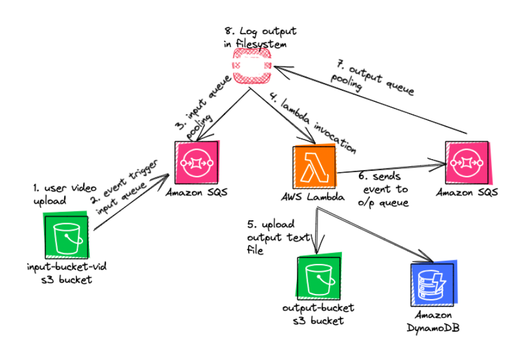
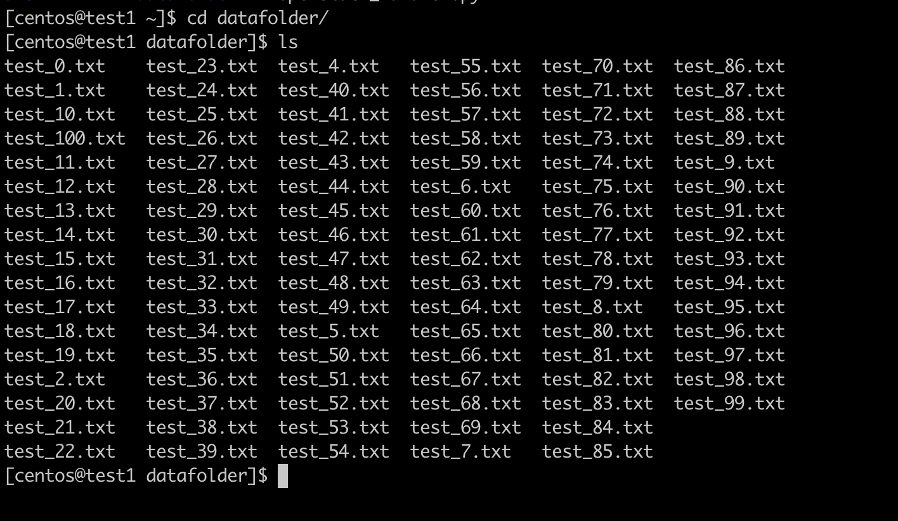
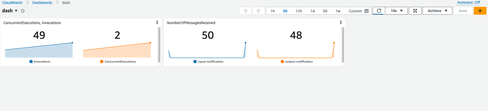
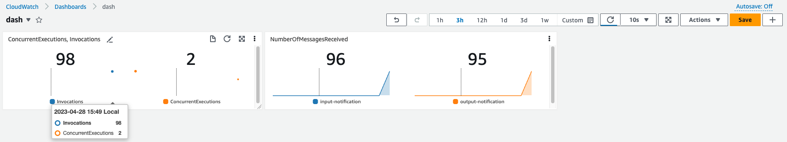
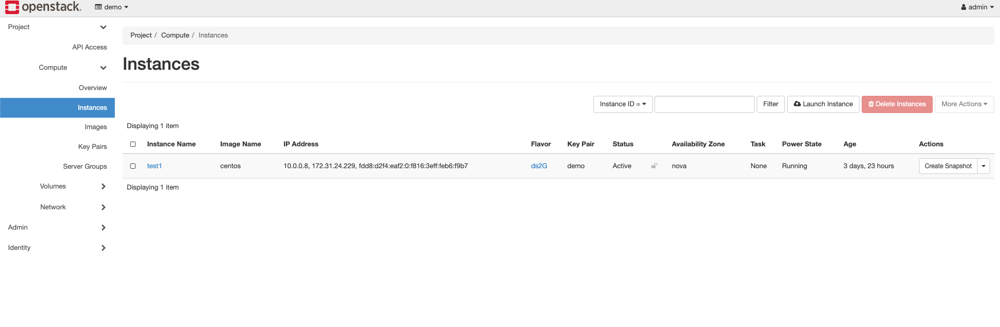
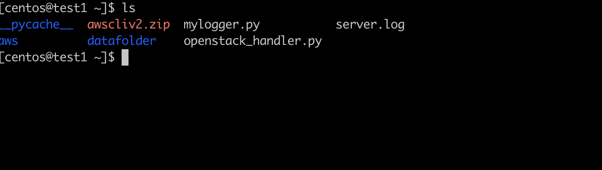

# Cloud Computing Project 3

Group Project 3: Hybrid Cloud

## 1. Overview
In our implementation, a user uploads an MP4 file to an S3 bucket (input-bucket-video). Upon successful upload, a Lambda function is triggered. This function, created from an image containing face recognition functionality (the Lambda handler function), extracts a frame from the video and stores it as an image. A facial recognition module runs on this image, creating an encoding. This encoding is matched with a known encoding file to retrieve the student's name. We then query a DynamoDB, which contains all relevant student information. The retrieved details are stored in CSV format and sent to another S3 bucket (output-bucket-vid).


## 2. Architecture

### 2.1 Intro and Diagram

In our implementation, a user uploads an MP4 file to an S3 bucket, which serves as the input bucket. Upon successful upload, an event is added to an input SQS. OpenStack continuously monitors and polls this input queue. When an event is detected, OpenStack invokes the Lambda function. This function, created from an image containing face recognition functionality (the Lambda handler function), extracts a frame from the video and stores it as an image. A facial recognition module runs on this image, creating an encoding. This encoding is matched with a known encoding file to retrieve the student's name. We then query a DynamoDB, which contains all relevant student information. Lambda handles all this processing and uploads the output to another S3 bucket (the output bucket). It also populates an output SQS. OpenStack monitors this output SQS, and when an event is detected, it loads the results in CSV format into a text file stored in the instance on OpenStack.



### 2.2. AWS Services Used

1. **AWS EC2**: A service for deploying and scaling virtual machines. Used to host the devstack.
2. **AWS SQS**: A managed message queuing service for asynchronous communication. Used to store events from S3 input buckets and by Lambda to populate the output queue.
3. **AWS S3**: A scalable and durable storage service. Used to store input videos and output CSV files.
4. **AWS Lambda**: A serverless computing service for running code in response to events. Used for facial recognition and uploading output to SQS and S3.
5. **AWS DynamoDB**: A NoSQL database service for storing structured and semi-structured data. Used to store student information.

## 3. OpenStack

### 3.1 OpenStack Services Used

1. **Horizon**: A web-based dashboard for managing OpenStack resources and services.
2. **Nova**: The compute service for creating and managing virtual machines.
3. **Neutron**: The networking service for managing virtual networks and network services.
4. **Glance**: The image service for managing disk images used to create virtual machines.

### 3.2 Setting up OpenStack

1. **AWS EC2 Instance**: An AWS EC2 t2.large instance was used to install devstack due to OpenStack's resource requirements.
2. **Devstack Installation**: Devstack was installed on the EC2 instance using the following commands:

```bash
sudo useradd -s /bin/bash -d /opt/stack -m stack
sudo chmod +x /opt/stack
echo "stack ALL=(ALL) NOPASSWD: ALL" | sudo tee /etc/sudoers.d/stack
sudo -u stack -i
git clone https://opendev.org/openstack/devstack
cd devstack
```

**local.conf**

```conf
[[local|localrc]]
ADMIN_PASSWORD=secret
DATABASE_PASSWORD=$ADMIN_PASSWORD
RABBIT_PASSWORD=$ADMIN_PASSWORD
SERVICE_PASSWORD=$ADMIN_PASSWORD
```

3. **Horizon Dashboard**: After installing devstack, the Horizon dashboard was launched.

4. **Image Upload**: A CentOS image (CentOS-7-x86_64-GenericCloud.qcow2c) was uploaded to Glance.

5. **Security Group Configuration**: A security group was configured to allow SSH and ICMP traffic.

6. **Network Setup**: A private network was created and bridged with the public network using a router.

7. **Key Pair Creation**: A key pair was created for SSH access to the instance.

8. **Floating IP**: A floating IP was attached to the instance for external access.


## 4. Testing

1. **Initial Verification**: Ensure both S3 buckets are initially empty.
2. **Upload Files**: Run `python3 workload.py` to upload the MP4 files.
3. **Input Bucket Verification**: Confirm the number of files in the input bucket matches the number of uploaded videos.
4. **Event Verification**: Check the number of events published by S3 matches the count of the uploaded videos.
5. **Lambda Function Trigger**: Verify that the Lambda function triggers when the input queue gets populated.
6. **Output Verification**: Check the output S3 bucket and queue for results.
7. **Concurrent Execution**: During execution, verify multiple concurrent executions by Lambda and that the total number of invocations equals the input queue/input S3 bucket count.
8. **Post-Execution Verification**: After execution, confirm the number of objects in the output bucket matches the number of initially uploaded videos.
9. **Queue Polling**: Validate constant polling of the output queue and fetching of messages by the OpenStack handler.
10. **OpenStack VM Verification**: Log into the VM in OpenStack and check if the OpenStack handler is writing the polled messages to the disk. The total number of messages should equal the number of uploaded videos.
11. **Output Verification**: Check each object in the output bucket to confirm that the text files contain the CSV formatted output of the corresponding input file.

## 5. Code

The application involves the following files:

1. **Dockerfile**: Modified to include the upload of encoding.
2. **Entry.sh**: Ensures the program runs in the correct directory.
3. **Handler.py**: The entry point for the Lambda function. It handles facial recognition, queries DynamoDB, processes messages, and pushes output to the S3 bucket.
4. **Openstack_handler.py**: Listens for messages on an input SQS queue, triggers the Lambda function, checks the output queue for messages, and saves them to a local folder.
5. **Mapping**: Contains the mapping for every MP4 file, providing information about each video's associated tags.
6. **Workload.py**: Clears both the input and output buckets at the start and pushes user-uploaded MP4 files into the input S3 bucket.
7. **ecr_push.sh**: A script to build, tag, and push the image to the ECR repository.

Steps to create the environment and run the program:

1. **Docker Setup**: Install Docker on your system.
2. **Docker Authentication**: Retrieve an authentication token and authenticate your Docker client to your registry.
3. **Image Creation**: Create an image using the Docker file.
4. **Push Image**: Push the image to Amazon ECR.
5. **Update Lambda**: Update the image URI on the Lambda function to reflect the uploaded handler.py.
6. **Run Workload Generator**: Run the workload generator.
7. **Input Bucket Verification**: Check the input bucket and verify that the videos are being uploaded successfully.
8. **Output Verification**: Check the output bucket and verify that the results are accurately labeled.


## 6. Output Screenshots

- **Input Video Files**: 
- **Cloudwatch In-Progress Logs**: 
- **AWS SQS**: 
- **Cloudwatch Logs of Queue Size**: 
- **Openstack Dashboard**: 
- **Openstack Instance**: 

## 7. Resources

- [AWS Lambda: Creating a deployment package](https://docs.aws.amazon.com/lambda/latest/dg/images-create.html)
- [Serverless Framework: AWS CLI Reference Deploy](https://www.serverless.com/framework/docs/providers/aws/cli-reference/deploy)