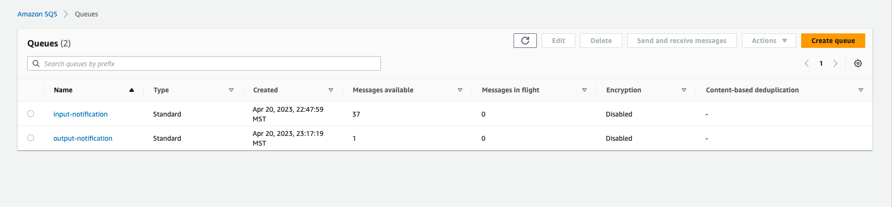

# Cloud Computing Project 3

Group Project 3: Hybrid Cloud

## 1. Overview
In our implementation, a user is asked to upload an MP4 file. The video is uploaded into an S3 bucket (input-bucket-video). Once the video is uploaded successfully, a Lamba function is triggered. This function is created out of an image containing the face recognition functionality, also known as the Lambda handler function. It extracts a frame from the video and stores it as an image. A facial recognition module is run on this image, which creates an encoding. The encoding is matched with a known encoding file to retrieve the name of the student. Finally, we use this name to query a DynamoDB, which contains all the relevant information of every student. Based on the query, the details retrieved are stored in CSV format and sent to another S3 bucket. This bucket serves as the output bucket (output-bucket-vid).


## 2. Architecture

### 2.1 Intro and Diagram

In our implementation, a user is asked to upload an MP4 file. The video is uploaded into an S3 bucket, which functions as an input bucket. Once the video is successfully uploaded, it simultaneously adds an event into an input SQS. OpenStack is continuously monitoring and polling the input queue. If OpenStack is alerted about an event in the input queue, it takes the input and invocates the Lambda function. This function is created from an image containing the face recognition functionality, also known as the Lambda handler function. It extracts a frame from the video and stores it as an image. A facial recognition module is run on this image, which creates an encoding. The encoding is matched with a known encoding file to retrieve the student's name. Finally, we use this name to query a DynamoDB, which contains all the relevant information of every student. All this processing is handled by Lambda. It then uploads the output into another S3 bucket, which serves as the output bucket. Additionally, it populates an output SQS as well. OpenStack is also monitoring this output SQS, and once there is anything in this output queue, it takes the event and loads the results in csv format into a text file, which is stored in the instance on OpenStack.


### 2.2. AWS Services Used

1. AWS EC2 - AWS EC2 is a web service that allows users to quickly deploy and scale virtual machines known as instances. EC2 instances can be deployed in several availability zones and configured with different operating systems, programs, and applications. Users can select from a range of instance types, each with different CPU, memory, storage, and networking capabilities. EC2 also provides features such as security groups, network access control, and monitoring to ensure the security and reliability of instances. EC2 was primarily used to deploy and host the devstack.

2. AWS SQS - Amazon Simple Queue Service (SQS) is a fully managed message queuing service that enables decoupling and asynchronous communication between distributed software components and microservices. It allows developers to send, store, and receive messages between different components of their application. SQS was used to store events based on the content in the S3 input buckets. It was also used by Lambda to populate the output queue.

3. AWS S3 - Amazon Simple Storage Service (S3) is a highly scalable and durable object storage service that allows users to store and retrieve any amount of data from anywhere on the web. It provides unlimited storage capacity, low latency, and high availability for various data types, including documents, images, videos, and application backups. S3 objects are organised into buckets and can be accessed via a REST API or a web console. S3 is used to store the input videos uploaded by the user and also the output csv formatted .txt files.

4. AWS Lambda - Amazon Lambda is a serverless computing service that enables developers to run code without provisioning or managing servers. It allows users to upload their code as functions and execute them in response to events, such as changes in data, user actions, or API calls. It supports a number of programming languages, including Python, Node.js, Java, and C#. A wide variety of serverless applications may be created using Lambda in combination with other AWS services, including S3, DynamoDB, SQS, and API Gateway. Lambda used for performing facial recognition and uploading the output event to SQS and output file to S3.

5. AWS DynamoDB - Amazon DynamoDB is a fully managed NoSQL database service that provides fast and flexible storage for structured and semi-structured data. Users can create and query tables with unlimited scalability, millisecond latency, and the capacity to store and retrieve any amount of data. DynamoDB supports various data models, including key-value, documents, and graphs. To create real-time and event-driven applications, DynamoDB may be used with other AWS services like Lambda, and S3. DynamoDb stored all the data related to the students and their information.

## 3. OpenStack

### 3.1 OpenStack Services Used

1. Horizon: Horizon is the web-based dashboard for OpenStack, which provides a graphical user interface (GUI) for managing resources and services in an OpenStack environment. It allows administrators and users to perform various tasks such as creating virtual machines, managing storage, configuring networks, and monitoring system performance.
2. Nova: Nova is the compute service of OpenStack, which provides the functionality to create and manage virtual machines (VMs). It allows users to launch instances with different operating systems and configurations and provides features such as automatic scaling, live migration, and high availability.
3. Neutron: Neutron is the networking service of OpenStack, which provides the functionality to create and manage virtual networks and network services. It allows users to configure and manage network resources such as routers, subnets, and security groups and provides features such as load balancing, VPN, and firewall.
4. Glance: Glance is the image service of OpenStack, which provides the functionality to store, retrieve, and manage disk images used to create virtual machines. It allows users to create and share custom images and provides features such as versioning, encryption, and caching.

### 3.2 Setting up OpenStack

1. OpenStack requires a large amount of computational resources. Due to this, we decided to make use of an AWS EC2 instance - t2.large, on which we installed devstack with the help of the commands given to us [3].
2. Install devstack on the EC2 instance. Some important code and configurations to remember are:

```bash
$ sudo useradd -s /bin/bash -d /opt/stack -m stack
$ sudo chmod +x /opt/stack
$ echo "stack ALL=(ALL) NOPASSWD: ALL" | sudo tee
/etc/sudoers.d/stack
$ sudo -u stack -i
$ git clone https://opendev.org/openstack/devstack
$ cd devstack
```

local.conf
```conf
[[local|localrc]]
ADMIN_PASSWORD=secret
DATABASE_PASSWORD=$ADMIN_PASSWORD
RABBIT_PASSWORD=$ADMIN_PASSWORD
SERVICE_PASSWORD=$ADMIN_PASSWORD
```
3. After installing devstack, we launched the Horizon dashboard.
4. We uploaded a CentOS image (CentOS-7-x86_64-GenericCloud.qcow2c) onto Glance.
5. We configured a security group that allows SSH requests and also all ICMP traffic.
6. Created a private network and bridged the private and public networks with a router.
7. After this we created a private network that we created. We also created a key pair so that we could SSH into the instance successfully.
8. To make it accessible from the outside, we attached a floating IP to the instance.


## 4. Testing
To test this application, we used the workload generator provided to us. These are the steps followed:
1. Verify that both S3 buckets are initially empty.
2. Run the following command to upload the MP4 files:

```bash
python3 workload.py
```

3. Verify that the number of files in the input bucket is equal to the number of videos uploaded by the user.
4. Check the number of events published by S3, which had to match the count of the videos uploaded to the input S3 bucket.
5. Check the logs to ensure that the Lambda function is being triggered as soon as the input input queue gets populated.
6. Check the output S3 bucket and output queue to see if results are being populated.
7. During the execution verify if there are multiple concurrent execution by lambda and the total number of invocations equals the input queue/input s3 bucket.
8. Once the execution of the program has been completed, verify that the number of objects in the output bucket is equal to the number of videos initially uploaded by the user.
9. Validate if the output queue is being constantly pooled and the openstack handler is fetching the messages from the queue.
10.Login to the VM in openstack and check if the openstack handler is writing the pooled messages to the disk. The count of the total number of messages should equal the number of input videos uploaded by the user.
11. Check each object in the output bucket to confirm that the text files contain the CSV formatted output of the pertaining input file.


5. Code
The files involved in this application are as follows:
1. Dockerfile: The dockerfile given to us required some changes. We included the upload of encoding in this file.
2. Entry.sh: This file ensures that the program runs in the appropriate directory.
3. Handler.py: This is the entry point when the lambda function kicks in. It contains code responsible for facial recognition on the file uploaded to the S3 bucket. It also queries the DynamoDB to fetch results. It runs an ffmpeg command which extracts a frame from the video and converts it to jpeg format. Then, an encoding is created and is compared with the encoding file given to us. This returns the name associated with the person in the image. The Lambda function processes the message and sends a response back to the output SQS queue. Finally, the
output is converted to CSV format and is pushed into the output S3 bucket.
4. Openstack_handler.py: The code listens for messages on an input SQS queue and sends the event to the Lambda function which is specified by the lambda_arn variable. The code also checks the output queue for messages and saves them to a local folder specified by the folder_path variable. The code uses the boto3 Python library to interact with AWS services, and the mylogger module
to log information to the console.
5. Mapping: This file contains the mapping for every MP4 file. It gives us
information about every tag associated with each video.
6. Workload.py: This file has functions which contain code to clear both the input
and output buckets when the program initially starts. It also pushes the user uplaoded MP4 files into the input S3 bucket.
7. ecr_push.sh: Created a script to run all commands necessary to log into, build and tag the created image, and push it to the ECR repository. This avoids running multiple commands repeatedly.
Steps to create the environment and run the program:
   1. Setup docker on your system.
   2. Retrieve an authentication token and authenticate your Docker client to your registry.
```bash
  aws ecr get-login-password --region us-east-1 | docker login --username AWS --password-stdin XXX.dkr.ecr.us-east-1.amazonaws.com
  ```
  3. Create an image containing using the Docker file to include files from the directory.
```bash
  docker build -t smart-classroom .
docker tag smart-classroom:latest 704676190155.dkr.ecr.us-east-1.amazonaws.com/smart-classroom:latest
  ```
  4. Push the image to Amazon ECR.
   ```bash
   docker push 704676190155.dkr.ecr.us-east-1.amazonaws.com/smart-classroom:latest
   ```
   5. Update the image URI on the Lambda function to reflect the uploaded handler.py.


   6. Run the workload generator with the following command:

```bash
python3 workload.py
```
   7. Check the input bucket and verify that the videos are being uploaded successfully. Ensure that the number of objects in the bucket matches the number of videos being uploaded.

   8. Check the output bucket and verify that the results are accurately labeled.

## 6. Output Screenshots




<!-- ## AWS Credentials and Accesses

- ECR Details
  - Region: us-east-1
  - URI: `arn:aws:lambda:us-east-1:595548125787:function:smart-classroom`
  - ECR Push Commands
  
    ```Retrieve an authentication token and authenticate your Docker client to your registry.
    Use the AWS CLI:

    aws ecr get-login-password --region us-east-1 | docker login --username AWS --password-stdin 595548125787.dkr.ecr.us-east-1.amazonaws.com
    
    Note: If you receive an error using the AWS CLI, make sure that you have the latest version of the AWS CLI and Docker installed.
    
    Build your Docker image using the following command. For information on building a Docker file from scratch see the instructions here . You can skip this step if your image is already built:

    docker build -t smart-classroom .
    After the build completes, tag your image so you can push the image to this repository:

    docker tag smart-classroom:latest 595548125787.dkr.ecr.us-east-1.amazonaws.com/smart-classroom:latest
    Run the following command to push this image to your newly created AWS repository:

    docker push 595548125787.dkr.ecr.us-east-1.amazonaws.com/smart-classroom:latest
    ```

- Lambda Details
  - Region: us-east-1
  - Function ARN: `arn:aws:lambda:us-east-1:595548125787:function:smart-classroom`
  - Architecture: arm64
  - ENTRYPOINT: `/entry.sh`
  - CMD: `handler.face_recognition_handler`
  - WORKDIR: `/home/app/`

- DyanmoDB Details
  - Region: us-east-1
  - Function Name: student_table
  - ARN: `arn:aws:dynamodb:us-east-1:595548125787:table/student-table`

- SQS 
  - input-notification: 
    - URL: https://sqs.us-east-1.amazonaws.com/595548125787/input-notification
  - output-notification
    - URL: https://sqs.us-east-1.amazonaws.com/595548125787/output-notification

- EC2 Instance
  - Instance ID: i-0f53f8d352abdcf0b
  - Public IP: 54.210.6.58
  
- OpenStack VM
  - Image Name: centos
  - IP Address: 172.31.24.229
  - Region: Nova -->


## Resources

- https://docs.aws.amazon.com/lambda/latest/dg/images-create.html
- https://www.serverless.com/framework/docs/providers/aws/cli-reference/deploy
